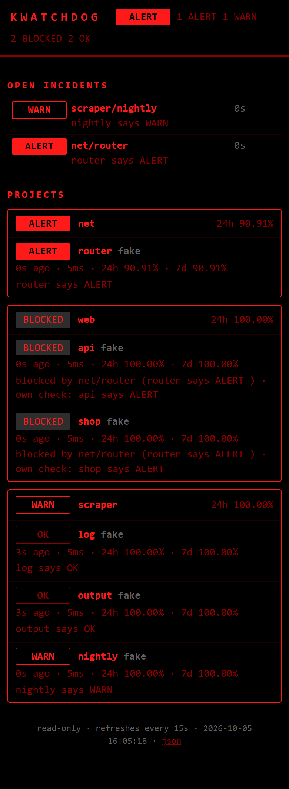
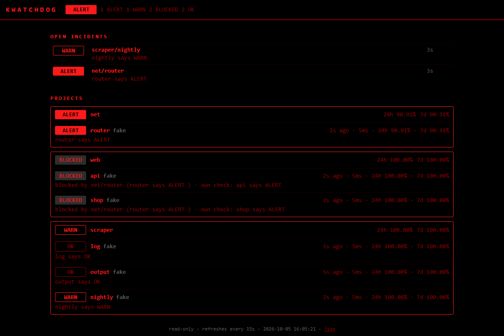

```
                 =
                :#=
                *##.
               -###*
               *####
               #####-
              -#####*
              *######-::..
             -#########%%%##+-::..
            :###########+++############*+==-::.
           .##########+:.@+#####################+
          .#####################################+
          #####################-:.VV  Vv  VV Vv
         *#################+%%%#=   ^   A vV
        -##################%%%%%+#+=A==AA^---:
        ###################%%%%%%%%%%%+#######.
       -####################%%%%%%%%%+=--:..
       #################=
      :##################
     ====o===o===o===o======
      +###################-
      #####################.
```

# kwatchdog

[](https://github.com/towa0/kwatchdog/actions/workflows/ci.yml)


**Modular terminal monitoring.** An asyncio daemon runs checks on schedules and
writes to SQLite; a red-on-black [Textual](https://textual.textualize.io) TUI
reads that state live. Watchers and notification channels are plugins. Runs on
Windows and Linux (Raspberry Pi included). Python 3.10+.

- 16 built-in watchers: HTTP/SSL, ping, TCP port, process/service, systemd, disk,
  CPU/RAM/temperature (Pi throttling), file freshness, log tail, git + GitHub CI,
  scraper health, SQLite/CSV anomaly, JSON metric, price thresholds, heartbeat
  (dead-man's switch), and arbitrary shell commands
- Alert pipeline: consecutive-failure thresholds, severity, flap damping, cooldown,
  quiet hours, escalation, dedup, recovery notices
- Channels: desktop toast, Telegram, ntfy.sh, Discord, email, terminal bell
- YAML config with hot reload. Validation errors show in the TUI and never
  crash the daemon. Secrets come only from env vars or `.env`.

| main view | drill-down |
|---|---|
|  |  |
| **add/edit form** | **splash** |
|  |  |

<sub>Screenshots are rendered headlessly from the real app (`App.run_test`) with a
fake failing service. The pulsing border is caught mid-pulse.</sub>

---

## Install

```bash
git clone https://github.com/towa0/kwatchdog && cd kwatchdog
pip install -e ".[all]"        # [all] = psutil + python-dotenv
# or, without cloning:
pipx install "kwatchdog[all] @ git+https://github.com/towa0/kwatchdog"
```

Optional extras: `psutil` (process + system watchers), `python-dotenv` (a basic
`.env` parser is built in), `plyer` (cross-platform toasts). If an optional
dependency is missing, the watcher that needs it shows as `SLEEPING` with a
`pip install …` hint. Nothing crashes.

On a Raspberry Pi (Bookworm): `sudo apt install python3-venv libnotify-bin` (the
second package is only needed for desktop toasts), then use a venv or pipx.

## Quick start

```bash
kwatchdog init                                   # ~/.watchdog/config.yaml
kwatchdog add web                                # new project
kwatchdog add web site http url=https://example.com body_regex="Example Domain" interval=30s
kwatchdog check                                  # run every check once (exit 0/1/2)
kwatchdog run                                    # daemon + TUI in one process
```

For long-running use, run the daemon as a service and attach the TUI whenever
you need it:

```bash
kwatchdog daemon          # headless, logs to ~/.watchdog/daemon.log
kwatchdog tui             # client; reads the same SQLite DB, sends commands back
```

### CLI

| command | what it does |
|---|---|
| `kwatchdog daemon [-v] [-q]` | run the checking daemon |
| `kwatchdog tui` | TUI client for a running daemon |
| `kwatchdog run` (or just `kwatchdog`) | daemon + TUI in one process |
| `kwatchdog add PROJECT [NAME TYPE key=value…]` | add a project or watcher. Validated before writing, comments kept |
| `kwatchdog check [project[/watcher]] [-v]` | run checks once and print them. Exit code 0 = OK, 1 = WARN, 2 = ALERT |
| `kwatchdog list` | current status from the DB |
| `kwatchdog validate` | validate the config, list errors and warnings |
| `kwatchdog plugins [-v]` | list watcher and channel types, availability, options |
| `kwatchdog ping NAME` | send a heartbeat locally |
| `kwatchdog notify-test [CHANNEL]` | send a test notification |
| `kwatchdog digest [--send] [--hours N]` | print (or send) the daily digest now |
| `kwatchdog autofix on\|off\|dry-run\|status\|list\|confirm ID\|reject ID` | auto-remediation kill switch and run log |
| `kwatchdog init [--force]` | write a starter config |

`-c/--config PATH` selects another config file. `$WATCHDOG_HOME` (default
`~/.watchdog`) holds the config, DB, log, `.env` and `plugins/`.

## Config

The full example with every watcher and channel is in
[`examples/config.yaml`](examples/config.yaml). The test suite validates it.

```yaml
settings:
  heartbeat_port: 8787          # GET /ping/<name> ; null disables
  retention_days: 30

channels:
  bell:  {type: bell}
  phone: {type: ntfy, topic: "${NTFY_TOPIC}", ignore_quiet: true, min_severity: ALERT}
  tg:    {type: telegram, token: "${TELEGRAM_TOKEN}", chat_id: "${TELEGRAM_CHAT_ID}"}

alerts:
  default:
    severity: WARN              # minimum status that notifies (WARN | ALERT)
    min_failures: 2             # consecutive failing checks before an incident opens
    cooldown: 10m               # min time between notifications per watcher
    flap_window: 10             # look at the last N checks…
    flap_threshold: 0.5         # …flapping if >= 50% of them changed OK<->failing
    quiet_hours: "23:00-07:00"  # only ignore_quiet channels during this window
    escalate_after: 30m         # one escalation if still failing after 30 min
    channels: [bell, tg]        # [] = all channels
    escalate_channels: [phone]
  critical: {severity: ALERT, min_failures: 1}   # named rules inherit from default

projects:
  shop:
    alerts: critical            # rule name, or an inline mapping of overrides
    watchers:
      - name: home
        type: http
        url: https://shop.example.com
        interval: 30s           # 90 / "90s" / "5m" / "2h" / "1d"
        timeout: 10s
        retries: 1              # retry before counting a failure
        latency_warn_ms: 800
      - name: worker-log
        type: logtail
        path: /var/log/shop/worker.log
        alerts: {cooldown: 1h}  # per-watcher override
```

Every watcher accepts the common keys `name`, `type`, `interval`, `timeout`,
`retries`, `retry_delay`, `enabled`, `alerts`, `description`, `tags`,
`depends_on`, `on_alert` and `slo` (the last three are covered below).
Projects accept `description`, `enabled`, `alerts`, `depends_on`, `slo` and
`watchers`.
Everything else goes to the watcher's own schema, and unknown keys are errors,
so typos get caught.

**Hot reload.** Saving the YAML reloads it within about a second. Only watchers
whose definition changed are restarted. If the new file doesn't parse, the
daemon keeps running the last good config, and the TUI banner shows the error.
If a single watcher is invalid, that watcher shows `SLEEPING · config error: …`
and the others keep running.

### Built-in watchers

| type | checks | key options |
|---|---|---|
| `http` | status, latency, body regex, SSL expiry, redirect chain | `url`, `expect_status`, `body_regex`, `body_not_regex`, `latency_warn_ms`/`_alert_ms`, `ssl_warn_days`/`_alert_days`, `max_redirects`, `expect_final_url` |
| `port` | TCP connect | `host`, `port` |
| `ping` | loss + RTT (system `ping`, any locale) | `host`, `count`, `latency_warn_ms`, `loss_warn_percent` |
| `process` | process by name / cmdline / PID file, or Windows service | `process`, `cmdline`, `pid_file`, `service`, `min_count` *(needs psutil)* |
| `systemd` | unit active (Linux) | `unit`, `user` |
| `disk` | used % / free GB | `path`, `warn_percent`, `alert_percent`, `min_free_gb` |
| `system` | CPU, RAM, temperature, Pi throttling (`vcgencmd`) | `cpu`, `ram`, `temp` (`{warn_above, alert_above}`), `throttle` *(needs psutil)* |
| `file` | newest write age in file/dir/glob, min size | `path`, `warn_age`, `max_age`, `min_size`, `recursive` |
| `logtail` | regex on *new* lines; rotation/truncation safe | `path`, `patterns`, `warn_patterns`, `ignore`, `min_matches`, `hold` |
| `git` | uncommitted, unpushed, behind remote, failing GitHub Actions | `path`, `fetch`, `uncommitted`/`unpushed`/`behind` (status), `check_ci`, `github_repo` |
| `scraper` | row-count drop vs baseline, last-success age, error rate | `db` + `*_query`, or `status_file`/`status_url` + `*_key`; `warn_drop_percent`, `max_success_age`, `error_rate_warn` |
| `datafile` | SQLite/CSV freshness + row-count z-score vs history | `path`, `table`, `timestamp_column`, `max_age`, `warn_z`, `alert_z` |
| `json` | any number from a JSON URL/file vs thresholds | `url`/`file`, `path` (`a.b[0].c`), `warn_above`… |
| `price` | thresholds, level crossings, % change over N checks | `url`/`file`, `path` or `regex`, `cross_above`, `cross_below`, `change_window`, `change_alert_percent` |
| `heartbeat` | dead-man's switch: silent too long | `ping`, `max_silence`, `warn_silence` |
| `shell` | exit code + stdout (regex / JSON / Nagios) | `command`, `ok_exit`, `warn_exit`, `regex`, `json_path`, `alert_regex`, `nagios`, `env` |

Run `kwatchdog plugins -v` to see every option with its default.

To match a Python script with `process`, use `cmdline: myscript.py`. The
process *name* of a script is its interpreter or entry point, not the script
file.

**Heartbeats.** Have the job call the daemon when it finishes. If no ping
arrives within `max_silence`, you get an alert.

```bash
./nightly_job.sh && curl -fsS http://raspberrypi:8787/ping/nightly
# or, on the same machine:  kwatchdog ping nightly
```

Set `heartbeat_host: 0.0.0.0` to accept pings from other machines. `/health`
returns the overall status as JSON.

### Status vocabulary

| | |
|---|---|
| **ALERT** | failing hard. Opens incidents and notifies, and the TUI border pulses |
| **WARN** | degraded (slow, stale, near a threshold) |
| **OK** | healthy |
| **SLEEPING** | disabled, missing dependency, wrong platform, config error, or not yet checked |
| **BLOCKED** | failing, but something it depends on is in ALERT. The dependency alerts, this one stays quiet |

### Dependencies

```yaml
projects:
  net:
    watchers:
      - {name: router, type: ping, host: 192.168.1.1}
  web:
    depends_on: [net/router]          # project-wide: every watcher below
    watchers:
      - {name: db, type: port, host: localhost, port: 5432}
      - {name: api, type: http, url: "http://localhost:8000/health", depends_on: [db]}
```

A `depends_on` entry is `project/watcher`, `watcher` (same project) or
`project` (every watcher in it). Unknown names and cycles are config errors
for the watcher that declares them.

When a watcher fails and one of its dependencies (directly or through a chain)
is in **ALERT**, the result is recorded as **BLOCKED**: `blocked by
net/router (no reply) · own check: connection refused`. BLOCKED never
notifies, resets the failure count and pauses escalation. The root cause sends
**one** alert, and that alert lists what it takes down: `… · root cause for 3
dependent(s): web/db, web/api, …`.

Two details:

* Before a failing dependent records its result, any dependency whose last
  verdict is older than 10 s is checked right away. If that dependency's
  check is already running, the dependent waits for it. So the order in which
  checks happen to run (at startup, say) doesn't decide which watcher alerts.
* Only failing dependents become BLOCKED. A dependent that still passes stays
  OK, and a dependency in WARN doesn't block anything. BLOCKED checks don't
  count against uptime.

### Auto-remediation (strict)

```yaml
remediations:                        # the allowlist: nothing else can ever run
  restart-scraper:
    command: ["systemctl", "--user", "restart", "scraper"]   # argv, no shell
    timeout: 60s
  clear-tmp:
    command: "find /tmp/scraper -mmin +60 -delete"           # a string is split, still no shell
    cwd: /tmp

projects:
  scraper:
    watchers:
      - name: alive
        type: process
        cmdline: scraper.py
        on_alert:
          command: restart-scraper   # a NAME from remediations:, never a command line
          max_runs_per_hour: 3
          cooldown: 10m
          require_confirm: false     # true = queue it, a human runs `kwatchdog autofix confirm ID`
          dry_run: false             # true = log what would run, never run it
```

The rules:

* A fix is attempted when a result is **ALERT** while an incident is open (that
  is, after `min_failures`). Muted, flapping, BLOCKED or WARN watchers are
  never touched. Further attempts follow `cooldown` and `max_runs_per_hour`.
* The command is an argv list run with `create_subprocess_exec`, with no
  shell. No templating exists, so watcher output, messages and metrics can't
  reach it. `${VAR}` in `command`/`env` is expanded once at config load, like
  any other config value.
* Every attempt is a row in the `remediation_runs` table: mode (`run`,
  `dry-run`, `pending`, `rate-limited`, `rejected`, `expired`, `off`), exit
  code, output (redacted, last 4 KB) and duration. See them with
  `kwatchdog autofix list -v` or in the TUI detail view.
* After a successful fix the watcher is re-checked immediately. If the fix
  exits non-zero, can't start, or times out, an **ALERT** goes out
  (`autofix 'restart-scraper' FAILED (exit 1): …`). Hitting the rate limit
  sends one ALERT per hour and stops trying.
* Kill switch: `kwatchdog autofix off` stops everything right away (it is
  stored in the DB and checked on every attempt). `kwatchdog autofix dry-run`
  logs without running, and `kwatchdog autofix on` turns it back on. Also in
  the TUI palette. `settings.autofix: false` is the master switch in config.
  While it's off, one `off` row per incident shows what would have run.
* `require_confirm: true` sends a WARN with the run id. Confirm with
  `kwatchdog autofix confirm ID` (or `f` in the TUI), or reject it. Pending
  requests expire after an hour, and confirming refuses to run while autofix
  is off or in dry-run.
* The fix runs as the daemon's user. Give that user exactly the rights the
  fix needs, for example a `sudoers` line for one `systemctl restart`, and
  nothing more.

### Alert rules in detail

* An **incident** opens after `min_failures` consecutive WARN/ALERT results.
  Each incident notifies once (**dedup**). A second notification goes out only
  if the incident gets worse (WARN → ALERT).
* **Cooldown**: no two notifications for the same watcher within `cooldown`. An
  alert held back by cooldown is sent later if the failure is still there.
* **Flap damping**: a watcher that keeps switching between OK and failing sends a
  single `FLAPPING` notice. It stays quiet until it is stable again, then sends
  `STABLE`.
* **Quiet hours**: during this window only channels with `ignore_quiet: true`
  receive notifications. Alerts held during the window go to the other channels
  when it ends.
* **Escalation**: if an incident is still open after `escalate_after`, one notice
  goes to `escalate_channels`. A timer checks this, so it fires even when the
  check interval is long.
* **Recovery**: the first OK closes the incident. A recovery notice is sent if
  the incident had notified.
* **Mute** (`m` in the TUI) keeps checks and incidents running and suppresses
  notifications. **Disable** (`d`) stops the checks.
* Channel `min_severity: ALERT` keeps WARN noise off that channel.

## Daily digest + uptime budgets

```yaml
digest:
  at: "07:30"            # local time; [] channels = every channel except bell
  channels: [telegram]
  stale_factor: 3        # "silently stale" = no check for 3x its interval

settings:
  slo_lookback: 24h      # burn-rate window for budget projections

projects:
  shop:
    slo: 99.9            # monthly uptime target for every watcher in the project
    watchers:
      - {name: home, type: http, url: "https://shop.example.com"}
      - {name: search, type: http, url: "https://shop.example.com/s?q=x", slo: 99.5}  # override
```

**The digest** goes out once a day through the existing channels. If the
daemon wasn't running at that time, it goes out when the daemon starts. It
covers the time since the previous digest:

```
kwatchdog digest · Tue 16 Jun 07:30
now: 1 ALERT · 14 OK · 1 SLEEPING

INCIDENTS last 24h00m (2)
  ALERT web/api 03:31-03:59 (28m): connect timeout
  WARN  scraper/log 05:02-still open (2h28m): 3 warning line(s): 429 Too Many Requests

UPTIME 24h: web 99.81% · scraper 100.00% · net 100.00%
FLAPPING: scraper/proxy

SILENTLY STALE (3)
  scraper/output: last check 5h00m ago (interval 1m00s)
  jobs/backup: muted for 3d0h more
  pi/nginx: not running - 'systemd' only works on linux (this is win32)

UPTIME BUDGETS (month)
  !! web/api: SLO 99.9% WILL MISS: projected 99.712% this month, 41% of 43m budget used, burn rate 5.2x

AUTOFIX (on): 2 attempt(s), 0 failed, 0 awaiting confirm
```

"Silently stale" lists things that look fine at a glance but aren't watching
anything: no check for longer than `stale_factor` × interval, never checked,
muted for more than a day, disabled, config errors, and watchers switched off
by a missing dependency or the wrong platform. Run `kwatchdog digest` to print
it now (`--hours 12` for a custom window), or `kwatchdog digest --send` to
deliver it.

**Uptime budgets.** `slo: 99.9` allows 0.1 % of the month as downtime, which is
43 minutes in a 30-day month. Downtime so far is estimated from month-to-date
uptime (share of non-ALERT checks; BLOCKED and SLEEPING don't count). The rest
of the month is projected at the burn rate of the last `slo_lookback`. Only
time the watcher was actually observed counts, and nothing is judged before
an hour of data. The budget is checked hourly:

* If the projection misses the target, one **ALERT** goes out (`BUDGET`
  notification, through the watcher's alert channels). It repeats at most once
  a day, and again if the state worsens to *exhausted*.
* The current budget line shows in the TUI detail view, on the status page and
  in the digest.
* Results are kept for at least 35 days, whatever `retention_days` says, so
  month-to-date numbers stay complete.

## Status page + JSON API (read-only)

```yaml
status_page:
  host: 127.0.0.1          # default; "lan" = 0.0.0.0, "tailscale" = this machine's 100.x address
  port: 8788
  token: ${STATUS_TOKEN}   # optional bearer token; set it for lan/tailscale
  refresh: 15              # page auto-refresh, seconds
```

Open `http://127.0.0.1:8788/`. The page is red-on-black and works on a phone.
It shows the same project tree as the TUI (status, last check, latency, uptime
24h/7d per watcher and per project), open incidents and recent incidents. It
pulses when anything is in ALERT and refreshes itself, with no JavaScript.

| endpoint | returns |
|---|---|
| `GET /` | the page |
| `GET /api/status` | everything the page shows, as JSON |
| `GET /api/incidents` | open + recent incidents |
| `GET /api/watchers/<project>/<name>` | one watcher + its last 50 results |
| `GET /healthz` | `{"ok": true}`. No token needed, reveals nothing |

* **Read-only.** Only GET and HEAD are accepted (anything else gets 405) and no
  endpoint changes state. Raw check output and autofix output are never
  exposed.
* **Token.** `Authorization: Bearer <token>`, for `curl` and scripts. On a
  phone, open `/?token=<token>` once. The server answers with an HttpOnly,
  SameSite=Strict cookie and redirects to `/`, so the token doesn't stay in
  the address bar. Tokens are compared in constant time.
* **Binding.** Loopback by default. With `host: lan` and no token, `kwatchdog
  validate` warns you. `host: tailscale` asks `tailscale ip -4` for the
  address. If that fails, the page is **not** started (it never falls back to
  0.0.0.0) and the error shows in the TUI banner. Plain HTTP is fine over
  Tailscale (WireGuard encrypts it). Don't expose it to the internet without a
  TLS reverse proxy.
* Every value is HTML-escaped, and the CSP is `default-src 'none'`, so a
  scraped page can't inject markup or scripts into the status page.

| phone | desktop |
|---|---|
|  |  |

## Secrets

Secrets never go in YAML. Reference them as `${VAR}` or `${VAR:-default}`,
and set them in the environment or in `~/.watchdog/.env` (or a `.env` in the
working directory):

```bash
# ~/.watchdog/.env   (chmod 600)
TELEGRAM_TOKEN=123456:ABC…
TELEGRAM_CHAT_ID=987654
NTFY_TOPIC=my-secret-topic
GITHUB_TOKEN=ghp_…
```

* `kwatchdog validate` warns when a key that looks like a secret (`token`,
  `password`, `webhook`, …) has a literal value in YAML.
* Every expanded value is registered and **redacted** (`***`) from logs, stored
  results, raw output and notification text.
* A missing env var is a config error for that watcher or channel only.

## The TUI

```
 KWATCHDOG  daemon pid 4242 :8787   2 ALERT   1 WARN   9 OK   1 SLEEPING   14:02:11
┌ PROJECTS ─────────┐┌ WATCHERS · all ──────────────────────────────────────────────┐
│!! web (3)          ││ STATUS   WATCHER        LAST  LATENCY TREND      MESSAGE      │
│ !! api 4s          ││ ALERT    web/api        4s           ▁▁▂▁█▇██    connect…     │
│ -- home 12s        ││ OK       web/home       12s   212ms  ▂▃▂▂▃▂▂▁    HTTP 200     │
└────────────────────┘└───────────────────────────────────────────────────────────────┘
```

| key | action |
|---|---|
| `tab` / `shift+tab` | switch panes (tree, table, alert feed) |
| `enter` | drill down: uptime 24h/7d, p50/p95 latency, latency chart, status strip, last 50 results with raw output, incident timeline |
| `a` / `e` | add / edit a watcher. The form is generated from the watcher's schema and validated before saving |
| `d` | disable / enable (watcher or whole project) |
| `m` | mute for N minutes (0 unmutes) |
| `r` | run the check now |
| `/` | fuzzy search (`esc` clears) |
| `ctrl+r` | reload config |
| `ctrl+p` | command palette (run all, unmute all, test notification, jump to any watcher) |
| `t` | test notification |
| `f` | confirm the pending autofix of the selected watcher |
| `h` | hide / show the key bar at the bottom (remembered across restarts) |
| `?` / `i` / `q` | help / about (the dog) / quit |

The TUI reads SQLite once per second. Actions go to the daemon through a
command table, so the client works the same whether the daemon runs embedded
(`kwatchdog run`) or as a separate service. If no daemon is running, the top
bar says `daemon SLEEPING`.

## Write your own watcher in 20 lines

Put a `.py` file in `~/.watchdog/plugins/`. Every `Watcher` subclass with a
`type` is picked up at startup. The file below is
[`examples/plugins/inbox.py`](examples/plugins/inbox.py), which the test suite
loads:

```python
from pathlib import Path

from kwatchdog.core.models import Result
from kwatchdog.core.plugin import Watcher, WatcherConfig


class InboxConfig(WatcherConfig):          # pydantic: validated, typos rejected
    path: str
    warn_above: int = 10
    alert_above: int = 100


class InboxWatcher(Watcher):
    type = "inbox"                          # used as `type: inbox` in YAML
    description = "alert when too many files wait in a folder"
    Config = InboxConfig

    async def check(self) -> Result:
        n = sum(1 for p in Path(self.config.path).expanduser().iterdir() if p.is_file())
        msg, metrics = f"{n} file(s) waiting", {"files": n}
        if n > self.config.alert_above:
            return Result.alert(msg, metrics=metrics)
        if n > self.config.warn_above:
            return Result.warn(msg, metrics=metrics)
        return Result.ok(msg, metrics=metrics)
```

```yaml
      - {name: uploads, type: inbox, path: /srv/uploads/pending, warn_above: 50}
```

What a watcher can use:

* `self.config`: your validated options. `self.timeout`: seconds (the daemon
  also enforces it, and retries per `retries`)
* `self.ctx.http()`: a shared `httpx.AsyncClient`
* `self.ctx.history("files", 20)`: previous values of a metric, for baselines and
  anomaly detection
* `self.ctx.state_get(k)` / `state_set(k, v)`: small JSON state that survives
  restarts (log offsets, for example)
* `self.ctx.heartbeat_last(name)`: the last heartbeat timestamp
* `requires = ("somepkg",)`: if the module isn't installed, the watcher shows as
  `SLEEPING` with a `pip install somepkg` hint. `platforms = ("linux",)` gates
  it by platform.
* Use `Result(..., latency_ms=…)` to feed the sparklines, and `raw=` for text
  shown in the drill-down.

If `check()` raises, the result becomes an `ALERT` with the traceback in the raw
output. If a plugin file fails to import, the error is listed in the TUI and
`kwatchdog plugins`, and the daemon keeps running. Channels work the same way:
subclass `Channel`, set `type` and `Config`, and implement
`async send(self, notification)`.

## Running as a service

### Raspberry Pi / Linux (systemd user unit)

```bash
pipx install ".[all]"                       # or a venv; adjust ExecStart below
mkdir -p ~/.config/systemd/user
cp deploy/kwatchdog.service ~/.config/systemd/user/
systemctl --user daemon-reload
systemctl --user enable --now kwatchdog
sudo loginctl enable-linger "$USER"         # start at boot, keep running after logout
journalctl --user -u kwatchdog -f           # or: tail -f ~/.watchdog/daemon.log
```

Then `kwatchdog tui` over SSH. The unit reads secrets from `~/.watchdog/.env`
through `EnvironmentFile`. To watch other systemd units, use the `systemd`
watcher. Add `user: true` for user units.

### Windows

The simplest option is a hidden Scheduled Task that starts at logon and
restarts on failure:

```powershell
powershell -ExecutionPolicy Bypass -File deploy\install-windows-task.ps1
# remove: Unregister-ScheduledTask -TaskName kwatchdog -Confirm:$false
```

It runs `pythonw -m kwatchdog daemon --quiet`, so no console window appears.
Child processes such as `ping` and `git` are also started without windows.

To run it as a real Windows service (starts before logon, runs under a service
account), use [NSSM](https://nssm.cc):

```powershell
nssm install kwatchdog "C:\Path\To\python.exe" "-m kwatchdog daemon --quiet"
nssm set kwatchdog AppEnvironmentExtra WATCHDOG_HOME=C:\Users\me\.watchdog
nssm start kwatchdog
```

Desktop toasts only work in an interactive session, so use ntfy, Telegram,
Discord or email for a service that runs before logon.

## Architecture

```
            config.yaml ──(mtime poll, diff)──┐
                                              ▼
 ┌──────────────── daemon (asyncio) ─────────────────────┐
 │  per-watcher loop → check() w/ timeout+retries        │
 │        │                                               │
 │        ▼                                               │      ┌────────────┐
 │  AlertEngine (pure) → incidents / notifications ──────┼────▶ │  channels  │
 │        │                                               │      └────────────┘
 │        ▼                                               │
 │  SQLite (WAL): results, watcher_state, incidents,     │◀── GET /ping/<name>
 │                events, kv, heartbeats, commands        │
 └────────▲───────────────────────────┬───────────────────┘
          │ commands (run/mute/…)     │ read every 1s
          └────────── TUI (Textual) ◀─┘
```

Layout: `kwatchdog/core` holds models, config, storage, the alert engine, the
daemon and the plugin system. `kwatchdog/watchers` and `kwatchdog/channels` hold
the auto-discovered built-ins. `kwatchdog/tui` holds the app, screens, theme and
the dog.

## Development

```bash
pip install -e ".[dev]"
ruff check kwatchdog tests
pytest -q                 # 150 tests: every watcher (mocked), alert rules, dependencies,
                          # autofix, status page, digest/budgets, config reload, plugin
                          # loading, daemon, CLI, TUI (headless)
```

CI runs the same on Ubuntu and Windows with Python 3.10 and 3.13.

## License

[MIT](LICENSE)
