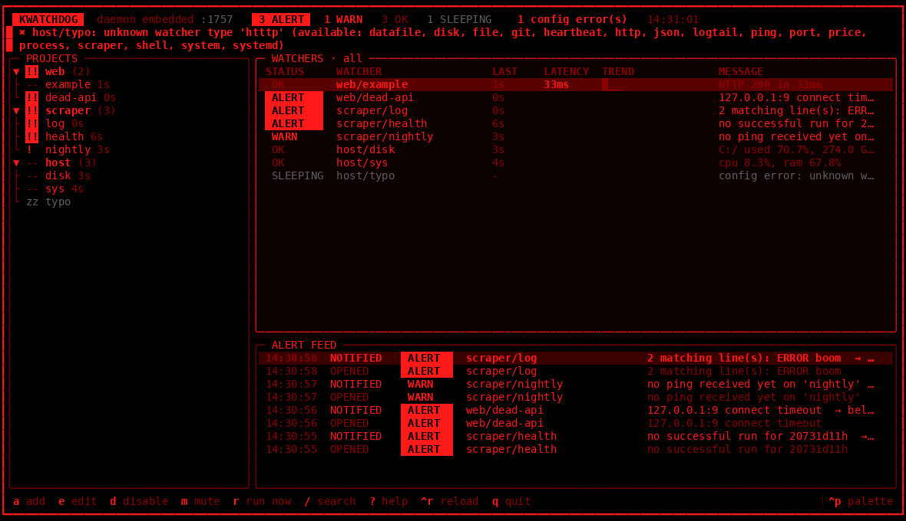
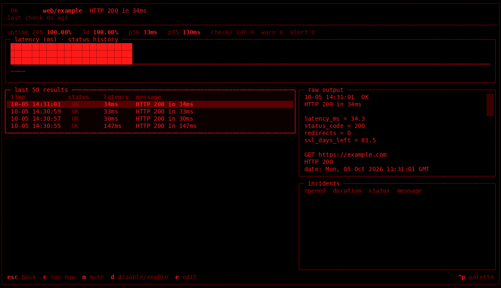
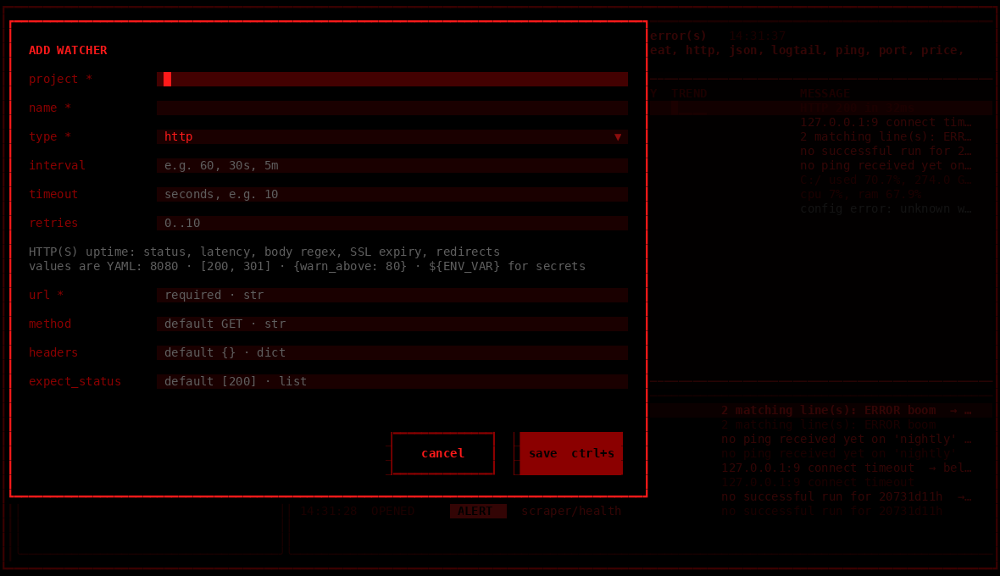

```
                 =
                :#=
                *##.
               -###*
               *####
               #####-
              -#####*
              *######-::..
             -#########%%%##+-::..
            :###########+++############*+==-::.
           .##########+:.@+#####################+
          .#####################################+
          #####################-:.VV  Vv  VV Vv
         *#################+%%%#=   ^   A vV
        -##################%%%%%+#+=A==AA^---:
        ###################%%%%%%%%%%%+#######.
       -####################%%%%%%%%%+=--:..
       #################=
      :##################
     ====o===o===o===o======
      +###################-
      #####################.
```

# kwatchdog

**Modular terminal monitoring.** An asyncio daemon runs checks on schedules and
writes to SQLite; a red-on-black [Textual](https://textual.textualize.io) TUI
reads that state live. Watchers and notification channels are plugins. Runs on
Windows and Linux (Raspberry Pi included). Python 3.10+.

- 16 built-in watchers: HTTP/SSL, ping, TCP port, process/service, systemd, disk,
  CPU/RAM/temperature (Pi throttling), file freshness, log tail, git + GitHub CI,
  scraper health, SQLite/CSV anomaly, JSON metric, price thresholds, heartbeat
  (dead-man's switch), and arbitrary shell commands
- Alert pipeline: consecutive-failure thresholds, severity, flap damping, cooldown,
  quiet hours, escalation, dedup, recovery notices
- Channels: desktop toast, Telegram, ntfy.sh, Discord, email, terminal bell
- YAML config with hot reload. Validation errors show in the TUI and never
  crash the daemon. Secrets come only from env vars or `.env`.

| main view | drill-down |
|---|---|
|  |  |
| **add/edit form** | **splash** |
|  |  |

<sub>Screenshots are rendered headlessly from the real app (`App.run_test`) with a
fake failing service. The pulsing border is caught mid-pulse.</sub>

---

## Install

```bash
pip install -e ".[all]"        # from a checkout; [all] = psutil + python-dotenv
# or: pipx install "git+https://…/kwatchdog.git#egg=kwatchdog[all]"
```

Optional extras: `psutil` (process + system watchers), `python-dotenv` (a basic
`.env` parser is built in), `plyer` (cross-platform toasts). If an optional
dependency is missing, the watcher that needs it shows as `SLEEPING` with a
`pip install …` hint. Nothing crashes.

On a Raspberry Pi (Bookworm): `sudo apt install python3-venv libnotify-bin` (the
second package is only needed for desktop toasts), then use a venv or pipx.

## Quick start

```bash
watchdog init                                   # ~/.watchdog/config.yaml
watchdog add web                                # new project
watchdog add web site http url=https://example.com body_regex="Example Domain" interval=30s
watchdog check                                  # run every check once (exit 0/1/2)
watchdog run                                    # daemon + TUI in one process
```

For long-running use, run the daemon as a service and attach the TUI whenever
you need it:

```bash
watchdog daemon          # headless, logs to ~/.watchdog/daemon.log
watchdog tui             # client; reads the same SQLite DB, sends commands back
```

### CLI

| command | what it does |
|---|---|
| `watchdog daemon [-v] [-q]` | run the checking daemon |
| `watchdog tui` | TUI client for a running daemon |
| `watchdog run` (or just `watchdog`) | daemon + TUI in one process |
| `watchdog add PROJECT [NAME TYPE key=value…]` | add a project or watcher. Validated before writing, comments kept |
| `watchdog check [project[/watcher]] [-v]` | run checks once and print them. Exit code 0 = OK, 1 = WARN, 2 = ALERT |
| `watchdog list` | current status from the DB |
| `watchdog validate` | validate the config, list errors and warnings |
| `watchdog plugins [-v]` | list watcher and channel types, availability, options |
| `watchdog ping NAME` | send a heartbeat locally |
| `watchdog notify-test [CHANNEL]` | send a test notification |
| `watchdog init [--force]` | write a starter config |

`-c/--config PATH` selects another config file. `$WATCHDOG_HOME` (default
`~/.watchdog`) holds the config, DB, log, `.env` and `plugins/`.

## Config

The full example with every watcher and channel is in
[`examples/config.yaml`](examples/config.yaml). The test suite validates it.

```yaml
settings:
  heartbeat_port: 8787          # GET /ping/<name> ; null disables
  retention_days: 30

channels:
  bell:  {type: bell}
  phone: {type: ntfy, topic: "${NTFY_TOPIC}", ignore_quiet: true, min_severity: ALERT}
  tg:    {type: telegram, token: "${TELEGRAM_TOKEN}", chat_id: "${TELEGRAM_CHAT_ID}"}

alerts:
  default:
    severity: WARN              # minimum status that notifies (WARN | ALERT)
    min_failures: 2             # consecutive failing checks before an incident opens
    cooldown: 10m               # min time between notifications per watcher
    flap_window: 10             # look at the last N checks…
    flap_threshold: 0.5         # …flapping if >= 50% of them changed OK<->failing
    quiet_hours: "23:00-07:00"  # only ignore_quiet channels during this window
    escalate_after: 30m         # one escalation if still failing after 30 min
    channels: [bell, tg]        # [] = all channels
    escalate_channels: [phone]
  critical: {severity: ALERT, min_failures: 1}   # named rules inherit from default

projects:
  shop:
    alerts: critical            # rule name, or an inline mapping of overrides
    watchers:
      - name: home
        type: http
        url: https://shop.example.com
        interval: 30s           # 90 / "90s" / "5m" / "2h" / "1d"
        timeout: 10s
        retries: 1              # retry before counting a failure
        latency_warn_ms: 800
      - name: worker-log
        type: logtail
        path: /var/log/shop/worker.log
        alerts: {cooldown: 1h}  # per-watcher override
```

Every watcher accepts the common keys `name`, `type`, `interval`, `timeout`,
`retries`, `retry_delay`, `enabled`, `alerts`, `description` and `tags`.
Everything else goes to the watcher's own schema, and unknown keys are errors,
so typos get caught.

**Hot reload.** Saving the YAML reloads it within about a second. Only watchers
whose definition changed are restarted. If the new file doesn't parse, the
daemon keeps running the last good config, and the TUI banner shows the error.
If a single watcher is invalid, that watcher shows `SLEEPING · config error: …`
and the others keep running.

### Built-in watchers

| type | checks | key options |
|---|---|---|
| `http` | status, latency, body regex, SSL expiry, redirect chain | `url`, `expect_status`, `body_regex`, `body_not_regex`, `latency_warn_ms`/`_alert_ms`, `ssl_warn_days`/`_alert_days`, `max_redirects`, `expect_final_url` |
| `port` | TCP connect | `host`, `port` |
| `ping` | loss + RTT (system `ping`, any locale) | `host`, `count`, `latency_warn_ms`, `loss_warn_percent` |
| `process` | process by name / cmdline / PID file, or Windows service | `process`, `cmdline`, `pid_file`, `service`, `min_count` *(needs psutil)* |
| `systemd` | unit active (Linux) | `unit`, `user` |
| `disk` | used % / free GB | `path`, `warn_percent`, `alert_percent`, `min_free_gb` |
| `system` | CPU, RAM, temperature, Pi throttling (`vcgencmd`) | `cpu`, `ram`, `temp` (`{warn_above, alert_above}`), `throttle` *(needs psutil)* |
| `file` | newest write age in file/dir/glob, min size | `path`, `warn_age`, `max_age`, `min_size`, `recursive` |
| `logtail` | regex on *new* lines; rotation/truncation safe | `path`, `patterns`, `warn_patterns`, `ignore`, `min_matches`, `hold` |
| `git` | uncommitted, unpushed, behind remote, failing GitHub Actions | `path`, `fetch`, `uncommitted`/`unpushed`/`behind` (status), `check_ci`, `github_repo` |
| `scraper` | row-count drop vs baseline, last-success age, error rate | `db` + `*_query`, or `status_file`/`status_url` + `*_key`; `warn_drop_percent`, `max_success_age`, `error_rate_warn` |
| `datafile` | SQLite/CSV freshness + row-count z-score vs history | `path`, `table`, `timestamp_column`, `max_age`, `warn_z`, `alert_z` |
| `json` | any number from a JSON URL/file vs thresholds | `url`/`file`, `path` (`a.b[0].c`), `warn_above`… |
| `price` | thresholds, level crossings, % change over N checks | `url`/`file`, `path` or `regex`, `cross_above`, `cross_below`, `change_window`, `change_alert_percent` |
| `heartbeat` | dead-man's switch: silent too long | `ping`, `max_silence`, `warn_silence` |
| `shell` | exit code + stdout (regex / JSON / Nagios) | `command`, `ok_exit`, `warn_exit`, `regex`, `json_path`, `alert_regex`, `nagios`, `env` |

Run `watchdog plugins -v` to see every option with its default.

To match a Python script with `process`, use `cmdline: myscript.py`. The
process *name* of a script is its interpreter or entry point, not the script
file.

**Heartbeats.** Have the job call the daemon when it finishes. If no ping
arrives within `max_silence`, you get an alert.

```bash
./nightly_job.sh && curl -fsS http://raspberrypi:8787/ping/nightly
# or, on the same machine:  watchdog ping nightly
```

Set `heartbeat_host: 0.0.0.0` to accept pings from other machines. `/health`
returns the overall status as JSON.

### Status vocabulary

| | |
|---|---|
| **ALERT** | failing hard. Opens incidents and notifies, and the TUI border pulses |
| **WARN** | degraded (slow, stale, near a threshold) |
| **OK** | healthy |
| **SLEEPING** | disabled, missing dependency, wrong platform, config error, or not yet checked |

### Alert rules in detail

* An **incident** opens after `min_failures` consecutive WARN/ALERT results.
  Each incident notifies once (**dedup**). A second notification goes out only
  if the incident gets worse (WARN → ALERT).
* **Cooldown**: no two notifications for the same watcher within `cooldown`. An
  alert held back by cooldown is sent later if the failure is still there.
* **Flap damping**: a watcher that keeps switching between OK and failing sends a
  single `FLAPPING` notice. It stays quiet until it is stable again, then sends
  `STABLE`.
* **Quiet hours**: during this window only channels with `ignore_quiet: true`
  receive notifications. Alerts held during the window go to the other channels
  when it ends.
* **Escalation**: if an incident is still open after `escalate_after`, one notice
  goes to `escalate_channels`. A timer checks this, so it fires even when the
  check interval is long.
* **Recovery**: the first OK closes the incident. A recovery notice is sent if
  the incident had notified.
* **Mute** (`m` in the TUI) keeps checks and incidents running and suppresses
  notifications. **Disable** (`d`) stops the checks.
* Channel `min_severity: ALERT` keeps WARN noise off that channel.

## Secrets

Secrets never go in YAML. Reference them as `${VAR}` or `${VAR:-default}`,
and set them in the environment or in `~/.watchdog/.env` (or a `.env` in the
working directory):

```bash
# ~/.watchdog/.env   (chmod 600)
TELEGRAM_TOKEN=123456:ABC…
TELEGRAM_CHAT_ID=987654
NTFY_TOPIC=my-secret-topic
GITHUB_TOKEN=ghp_…
```

* `watchdog validate` warns when a key that looks like a secret (`token`,
  `password`, `webhook`, …) has a literal value in YAML.
* Every expanded value is registered and **redacted** (`***`) from logs, stored
  results, raw output and notification text.
* A missing env var is a config error for that watcher or channel only.

## The TUI

```
 KWATCHDOG  daemon pid 4242 :8787   2 ALERT   1 WARN   9 OK   1 SLEEPING   14:02:11
┌ PROJECTS ─────────┐┌ WATCHERS · all ──────────────────────────────────────────────┐
│!! web (3)          ││ STATUS   WATCHER        LAST  LATENCY TREND      MESSAGE      │
│ !! api 4s          ││ ALERT    web/api        4s           ▁▁▂▁█▇██    connect…     │
│ -- home 12s        ││ OK       web/home       12s   212ms  ▂▃▂▂▃▂▂▁    HTTP 200     │
└────────────────────┘└───────────────────────────────────────────────────────────────┘
```

| key | action |
|---|---|
| `tab` / `shift+tab` | switch panes (tree, table, alert feed) |
| `enter` | drill down: uptime 24h/7d, p50/p95 latency, latency chart, status strip, last 50 results with raw output, incident timeline |
| `a` / `e` | add / edit a watcher. The form is generated from the watcher's schema and validated before saving |
| `d` | disable / enable (watcher or whole project) |
| `m` | mute for N minutes (0 unmutes) |
| `r` | run the check now |
| `/` | fuzzy search (`esc` clears) |
| `ctrl+r` | reload config |
| `ctrl+p` | command palette (run all, unmute all, test notification, jump to any watcher) |
| `t` | test notification |
| `?` / `i` / `q` | help / about (the dog) / quit |

The TUI reads SQLite once per second. Actions go to the daemon through a
command table, so the client works the same whether the daemon runs embedded
(`watchdog run`) or as a separate service. If no daemon is running, the top
bar says `daemon SLEEPING`.

## Write your own watcher in 20 lines

Put a `.py` file in `~/.watchdog/plugins/`. Every `Watcher` subclass with a
`type` is picked up at startup. The file below is
[`examples/plugins/inbox.py`](examples/plugins/inbox.py), which the test suite
loads:

```python
from pathlib import Path

from kwatchdog.core.models import Result
from kwatchdog.core.plugin import Watcher, WatcherConfig


class InboxConfig(WatcherConfig):          # pydantic: validated, typos rejected
    path: str
    warn_above: int = 10
    alert_above: int = 100


class InboxWatcher(Watcher):
    type = "inbox"                          # used as `type: inbox` in YAML
    description = "alert when too many files wait in a folder"
    Config = InboxConfig

    async def check(self) -> Result:
        n = sum(1 for p in Path(self.config.path).expanduser().iterdir() if p.is_file())
        msg, metrics = f"{n} file(s) waiting", {"files": n}
        if n > self.config.alert_above:
            return Result.alert(msg, metrics=metrics)
        if n > self.config.warn_above:
            return Result.warn(msg, metrics=metrics)
        return Result.ok(msg, metrics=metrics)
```

```yaml
      - {name: uploads, type: inbox, path: /srv/uploads/pending, warn_above: 50}
```

What a watcher can use:

* `self.config`: your validated options. `self.timeout`: seconds (the daemon
  also enforces it, and retries per `retries`)
* `self.ctx.http()`: a shared `httpx.AsyncClient`
* `self.ctx.history("files", 20)`: previous values of a metric, for baselines and
  anomaly detection
* `self.ctx.state_get(k)` / `state_set(k, v)`: small JSON state that survives
  restarts (log offsets, for example)
* `self.ctx.heartbeat_last(name)`: the last heartbeat timestamp
* `requires = ("somepkg",)`: if the module isn't installed, the watcher shows as
  `SLEEPING` with a `pip install somepkg` hint. `platforms = ("linux",)` gates
  it by platform.
* Use `Result(..., latency_ms=…)` to feed the sparklines, and `raw=` for text
  shown in the drill-down.

If `check()` raises, the result becomes an `ALERT` with the traceback in the raw
output. If a plugin file fails to import, the error is listed in the TUI and
`watchdog plugins`, and the daemon keeps running. Channels work the same way:
subclass `Channel`, set `type` and `Config`, and implement
`async send(self, notification)`.

## Running as a service

### Raspberry Pi / Linux (systemd user unit)

```bash
pipx install ".[all]"                       # or a venv; adjust ExecStart below
mkdir -p ~/.config/systemd/user
cp deploy/kwatchdog.service ~/.config/systemd/user/
systemctl --user daemon-reload
systemctl --user enable --now kwatchdog
sudo loginctl enable-linger "$USER"         # start at boot, keep running after logout
journalctl --user -u kwatchdog -f           # or: tail -f ~/.watchdog/daemon.log
```

Then `watchdog tui` over SSH. The unit reads secrets from `~/.watchdog/.env`
through `EnvironmentFile`. To watch other systemd units, use the `systemd`
watcher. Add `user: true` for user units.

### Windows

The simplest option is a hidden Scheduled Task that starts at logon and
restarts on failure:

```powershell
powershell -ExecutionPolicy Bypass -File deploy\install-windows-task.ps1
# remove: Unregister-ScheduledTask -TaskName kwatchdog -Confirm:$false
```

It runs `pythonw -m kwatchdog daemon --quiet`, so no console window appears.
Child processes such as `ping` and `git` are also started without windows.

To run it as a real Windows service (starts before logon, runs under a service
account), use [NSSM](https://nssm.cc):

```powershell
nssm install kwatchdog "C:\Path\To\python.exe" "-m kwatchdog daemon --quiet"
nssm set kwatchdog AppEnvironmentExtra WATCHDOG_HOME=C:\Users\me\.watchdog
nssm start kwatchdog
```

Desktop toasts only work in an interactive session, so use ntfy, Telegram,
Discord or email for a service that runs before logon.

## Architecture

```
            config.yaml ──(mtime poll, diff)──┐
                                              ▼
 ┌──────────────── daemon (asyncio) ─────────────────────┐
 │  per-watcher loop → check() w/ timeout+retries        │
 │        │                                               │
 │        ▼                                               │      ┌────────────┐
 │  AlertEngine (pure) → incidents / notifications ──────┼────▶ │  channels  │
 │        │                                               │      └────────────┘
 │        ▼                                               │
 │  SQLite (WAL): results, watcher_state, incidents,     │◀── GET /ping/<name>
 │                events, kv, heartbeats, commands        │
 └────────▲───────────────────────────┬───────────────────┘
          │ commands (run/mute/…)     │ read every 1s
          └────────── TUI (Textual) ◀─┘
```

Layout: `kwatchdog/core` holds models, config, storage, the alert engine, the
daemon and the plugin system. `kwatchdog/watchers` and `kwatchdog/channels` hold
the auto-discovered built-ins. `kwatchdog/tui` holds the app, screens, theme and
the dog.

## Development

```bash
pip install -e ".[dev]"
pytest -q                 # 110 tests: every watcher (mocked), alert rules, config
                          # reload, plugin loading, daemon, CLI, TUI (headless)
```
